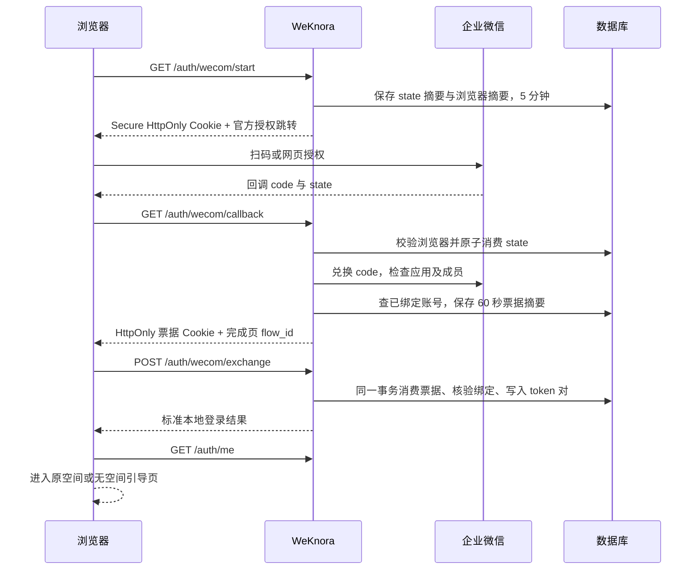

# 企业微信登录与已有账号绑定（DISON 定制）

本文对应 `feature/wecom-login` 的实现，交付目标是合并到 `dison/prod`，不向上游提交 PR。功能默认关闭，不改变已有邮箱密码登录、OIDC、注册模式或空间授权策略。

## 1. 实现范围与架构结论

本次支持标准服务端 Web 部署中的企业微信自建应用：电脑浏览器使用企业微信 Web 登录，企业微信内置浏览器使用网页授权。每个部署配置一个企业、一个自建应用，登录后的用户可以访问其原有的多个空间。Lite 版本不开放此入口。

员工必须先有系统账号，由系统管理员明确绑定企业微信成员 UserID。绑定复用原 `users.id`，所以原邮箱、密码、知识库所有权、空间成员关系、分享权限、个人设置都保留。不读取企业微信邮箱来自动匹配，不用显示名称匹配，不创建第二个账号，不自动授予角色。

本次没有实现自动注册、部门同步、第三方服务商应用、跨企业互联成员、无邮箱账号或自动离职同步。暂停/撤销企业微信绑定只撤销由该绑定产生的企业微信会话；密码及 OIDC 登录仍可使用。完整离职处理仍须按照现有账号、空间成员和 API Key 管理流程执行。

### 为什么作为定制功能

OIDC 可以通过身份代理间接接入企业微信，但企业微信自建应用的原生扫码/网页授权接口不是 OIDC Provider。LDAP 对接目录账号与密码，不直接处理扫码授权。现有 OIDC 登录还有自己的账号创建和邮箱映射流程，不能等同于本功能的“仅登录已绑定账号”。

2026-09-29 已通过 GitHub API 分页检查上游全部可见 PR/issue 的标题和正文，并检查全量 issue/PR 普通讨论评论：共 3,789 条（开放 PR 244、关闭 PR 2,290、开放 issue 323、关闭 issue 932），普通评论 2,861 条。关闭 PR 包含已合并和未合并条目；对重点 PR 另查合并状态及 review。相关证据如下：

| 条目 | 状态与内容 | 本次处理 |
| --- | --- | --- |
| [#2386](https://github.com/Tencent/WeKnora/issues/2386) | 已关闭；明确提出企业域/企业微信账号绑定。维护者回复已有 OIDC、注册控制及系统管理员能力 | 不把关闭解释为原生绑定已实现，也不声称维护者拒绝原生集成 |
| [#805](https://github.com/Tencent/WeKnora/issues/805)、[#833](https://github.com/Tencent/WeKnora/pull/833) | OIDC 需求与对应实现；讨论倾向通过 OIDC 代理适配不同认证源 | 保留 OIDC，定制层增加独立入口 |
| [#1770](https://github.com/Tencent/WeKnora/pull/1770) | LDAP/AD 登录 PR，检查时仍开放、未合并 | 不宣称当前 `main` 已包含 LDAP |
| [#1098](https://github.com/Tencent/WeKnora/pull/1098) | OIDC 一次性回调票据 PR，未合并关闭，无普通评论或 review 说明关闭原因 | 本功能独立实现数据库票据与浏览器绑定，不改 OIDC 回调 |
| [#2799](https://github.com/Tencent/WeKnora/issues/2799)、[#2932](https://github.com/Tencent/WeKnora/pull/2932) | OIDC 身份令牌验证问题及修复 | 企业微信仅信任服务端调用官方接口得到的企业成员身份 |
| [#1037](https://github.com/Tencent/WeKnora/issues/1037) | 用户列表、角色、账号禁用的管理需求，仍开放 | 不把整个用户管理系统并入本次登录功能 |
| [#1556](https://github.com/Tencent/WeKnora/pull/1556) | JWT 生命周期配置 PR，仍开放 | 保留现有 access 24 小时、refresh 7 天的期限 |
| [#2257](https://github.com/Tencent/WeKnora/issues/2257) | 外部账号及多租户打通需求 | 保留现有 `web_user` 与空间成员授权，不映射外部角色 |

此检索反映当时公开可见的数据，不覆盖删除、私有讨论或检查之后的新增条目。按最终交付决定，仅在定制分支维护，不创建 PR。

## 2. 部署配置

```dotenv
WECOM_AUTH_ENABLED=true
WECOM_AUTH_CORP_ID=ww_your_corp_id
WECOM_AUTH_AGENT_ID=1000002
WECOM_AUTH_SECRET=your_self_built_application_secret
WECOM_AUTH_PUBLIC_ORIGIN=https://knowledge.example.com
```

- `WECOM_AUTH_SECRET` 只从环境变量读取，不通过管理接口或 JSON 配置响应返回，不应提交到 Git。
- `PUBLIC_ORIGIN` 必须是浏览器实际访问的 HTTPS origin，不含路径、末尾斜杠、查询参数、片段或用户名密码。首版要求在域名根路径部署。
- 回调固定为 `https://knowledge.example.com/api/v1/auth/wecom/callback`；完成页固定为 `/login/wecom/complete`。请求 Host、Referer 或外部传入的跳转参数不决定回调地址。
- `docker-compose.yml` 已传入这五个变量；其他部署方式需要将它们注入后端进程。修改后重启后端。多副本需共用数据库、配置和稳定的 `JWT_SECRET`。
- 未启用时，新登录入口及绑定界面隐藏，接口返回不可用；Lite 始终不启用。
- 关闭开关后，既有企业微信会话也不再被接受。若需要永久终止一批会话，应先暂停或撤销绑定；单纯关闭开关再开启不是永久撤销操作。

### 企业微信管理端准备

1. 创建自建应用，记录 CorpID、AgentID 和该应用 Secret。
2. 将试点员工加入应用可见范围，确认成员已激活且未禁用/离职。
3. 按管理端要求配置网页授权可信域名、Web 登录授权回调域名，并完成域名归属校验。
4. 配置调用 API 的服务器可信 IP；确认实际出口 IP，包括反向代理/NAT 后的地址。
5. 系统的前端、`/api/v1` 和 HTTPS 回调须位于同一公共 origin；反向代理应正常转发 Cookie、Origin 与 Set-Cookie。
6. 先在测试应用/测试账号上走通绑定与扫码，确认后再开放应用可见范围。

代码和本地模拟验证不能证明真实应用权限、企业设置及域名已就绪。本次未读取或修改生产企业微信配置。

## 3. 管理员操作

入口：**设置 → 系统设置 → 账户与访问 → 企业微信账号绑定**。只对系统管理员开放，普通用户、空间 API Key 和平台 API Key 均不能操作。

1. 如员工尚无账号，先使用现有“创建用户”功能创建，按业务需要安排空间成员和角色。
2. 输入其已有系统邮箱及企业微信通讯录中的成员 UserID，点击“核对账号”。
3. 后端根据邮箱精确查询已有账号，并调用企业微信检查应用和成员。预览显示本地用户名/邮箱、企业成员名/UserID、企业 ID。
4. 管理员检查双方确为同一人，再点击“确认绑定”。预览凭据 5 分钟有效、只能使用一次，绑定于核对操作的管理员和企业。
5. 列表支持暂停、恢复、撤销和操作记录。每页 100 条，可翻页。

成员 UserID 按企业微信规则忽略大小写，保存规范化结果；不是手机号、微信号或成员姓名。一个企业成员只能映射一个本地账号，一个本地账号在同一企业只能有一个未撤销绑定。

绑定错误时，先撤销旧绑定，再重新核对正确账号。撤销记录保留审计历史；重新绑定同一企业成员保留身份记录 ID，但递增版本。恢复或重新绑定均不会让旧会话重新有效。

操作记录保存身份 ID、操作者 ID、操作、目标用户 ID、版本及时间，不保存授权码、应用 Secret 或登录票据。此记录独立存储，暂未并入平台统一审计日志页面。

## 4. 登录时序与安全边界



- 电脑端：`https://login.work.weixin.qq.com/wwlogin/sso/login`，参数 `login_type=CorpApp`、`appid`、`agentid`、`redirect_uri`、`state`。
- 企业微信内：`https://open.weixin.qq.com/connect/oauth2/authorize`，使用 `snsapi_base`；通过 User-Agent 选择流程，不把 User-Agent 当作身份凭证。
- 后端：`gettoken` → `auth/getuserinfo` → `agent/get` → `user/get`。只接收激活的本企业成员，不接收访客 OpenID、外部联系人或互联企业成员。
- 应用 token 在进程内缓存，提前留出过期余量。仅在明确的 token 无效/过期错误时刷新并重试一次；授权码调用超时不盲目重放。HTTP 请求超时 10 秒，不跟随 API 重定向，不返回包含凭据 URL 的底层错误。
- state、浏览器随机值和 ticket 都使用 32 字节密码学随机数；数据库只保存 SHA-256 摘要。
- 浏览器绑定 Cookie 和每个 flow 独立的 ticket Cookie 均为 `__Host-` 前缀、Secure、HttpOnly、SameSite=Lax、Path=/，不设置 Domain。
- 地址栏只携带非凭据的 `flow_id`；登录令牌与 ticket 不进入 URL。一次性 ticket 不进入前端存储或页面脚本；最终 access/refresh 令牌仍遵循项目现有的本地会话存储方式。
- 兑换要求精确匹配配置的 Origin、flow ID、票据 Cookie 和浏览器摘要；多标签页使用各自票据 Cookie，不会兑换另一标签页的登录结果。
- 所有登录响应均禁止缓存并设置 `Referrer-Policy: no-referrer`。应用日志遮盖 code、state、token 和绑定预览凭据。反向代理也必须避免记录完整 OAuth 查询参数、Cookie 或响应头。
- 未绑定、成员不可见、权限不足、过期、网络异常均拒绝登录；前端提示重试或联系管理员，不降级为匿名身份或自动建号。

## 5. 数据、事务与现有授权

PostgreSQL 迁移 `000115_wecom_login`，SQLite 迁移 `000034_wecom_login`：

| 表/字段 | 用途 |
| --- | --- |
| `we_com_identities` | CorpID、规范化 UserID、本地 `user_id`、显示名、状态、版本 |
| `we_com_flows` | state、登录 ticket、绑定预览的单次凭据摘要及短期上下文 |
| `we_com_identity_events` | 绑定、暂停、恢复、撤销的操作记录 |
| `auth_tokens.auth_method` | 企业微信来源为 `wecom`；旧会话保持空值兼容 |
| `auth_tokens.external_identity_id/version` | 会话绑定到签发时的身份及版本 |
| `auth_tokens.session_family_id` | 保持同一次登录衍生的刷新和切换空间关系 |

新 JWT 增加随机 `jti`，防止同一秒重复签发产生相同字符串。access/refresh 两条记录由同一事务写入，写入任一失败都不返回可用半会话。

签发、刷新、绑定状态变更、用户会话批量撤销通过同一用户行写锁顺序协调，兼容 PostgreSQL 和 SQLite。刷新时在事务内消费旧 refresh；并发兑换同一票据或刷新凭据只能成功一次。事务内重新读取来源会话、账号激活状态、绑定归属、状态及版本，不只依赖请求进入时的检查。

切换空间仍执行原有成员资格检查；新 token 对继承当前 access token 的身份与会话来源。传入的 refresh token 必须属于同一用户、有效、类型正确；有 family 的新会话还要求同一 family。旧 token 的空 family 仅与同用户的旧凭据兼容，不从客户端接受来源信息。

普通 JWT 校验、刷新及沙箱终端/桌面使用的 token 行查询都会复核绑定。已连接沙箱会话仍按原有周期复核，继续保持“普通 access 到期不主动杀掉正在使用的终端”的行为；绑定撤销或版本变化属于明确失效。账号 `is_active=false` 也会阻止普通 Web token 校验。

注销/改密使用的批量会话撤销同时删除该用户尚未兑换的企业微信 ticket/预览记录。恢复绑定不撤销原有密码能力，也不授予系统管理员或额外空间权限。

## 6. 接口与代码入口

所有接口均位于 `/api/v1`：

| 方法与路径 | 说明 |
| --- | --- |
| GET `/auth/wecom/config` | 只返回 enabled |
| GET `/auth/wecom/start` | 创建浏览器绑定，跳转官方授权 |
| GET `/auth/wecom/callback` | 校验/消费 state，成员核验，签发短期票据 |
| POST `/auth/wecom/exchange` | `{flow_id}`，Cookie 兑换登录结果 |
| GET `/system/admin/wecom/bindings?offset=0` | 管理列表，每页 100 条 |
| POST `/system/admin/wecom/preview` | `{email, subject}`，核对已有账号和成员 |
| POST `/system/admin/wecom/bindings` | `{preview_token}`，确认绑定 |
| PUT `/system/admin/wecom/bindings/:id` | `{status, version}`，带版本条件变更状态 |
| GET `/system/admin/wecom/bindings/:id/events` | 最近 100 条操作记录 |

主要实现：

- `internal/auth/wecom/`：官方协议客户端、响应校验、应用 token 缓存。
- `internal/config/wecom_auth.go`：配置加载、HTTPS origin 校验、Secret 隔离。
- `internal/application/repository/auth_session.go`：token 对、票据及刷新原子事务。
- `internal/application/repository/wecom_auth.go`：绑定、短期流程、版本及审计。
- `internal/application/service/wecom_auth.go` / `user_wecom.go`：授权流程与已有用户登录。
- `internal/handler/wecom_auth.go` / `internal/router/routes_wecom_auth.go`：Cookie、固定跳转、Origin 与权限控制。
- `frontend/src/views/auth/WeComComplete.vue`：兑换、清理旧账号缓存、同步原账号会话。
- `frontend/src/views/system/WeComBindings.vue`：绑定与状态管理。

## 7. 验证与上线验收

已执行的代码验证：

- PostgreSQL 与 SQLite 的生产迁移、回滚保留本地账号及普通登录会话、回滚后重新升级不恢复企业微信会话、绑定唯一性、核对凭据重放、绑定修正、事务回滚、并发兑换/刷新、暂停恢复、旧版本拒绝、错误来源 family 拒绝。
- 官方接口模拟：激活成员、访客、外部联系人、禁用/未激活/离职成员、互联企业、token 过期重试及错误脱敏。
- 服务完整流程：已有邮箱账号绑定、浏览器 state、防重放、登录、刷新、空间切换及越权拒绝、撤销后沙箱复核。
- HTTP 层：Secure Cookie、恶意 Host/跳转参数、Origin、缺失 Cookie、关闭开关、Lite 禁用、普通用户及两类 API Key 拒绝。
- 新增流程竞态检测、相关 Go 包静态检查；前端类型检查、语言键检查和生产构建。前端完整测试为 1,349 通过、1 项原有跳过；本机 Node 25 运行时使用 `NODE_OPTIONS=--no-experimental-webstorage`，避免其实验性全局 localStorage 干扰项目的测试替身。
- 完整后端回归与修改前基线对比：两边均有同一组 41 项失败，无新增失败。涉及本机 DNS 将 example.com/api.e2b.app 等解析到 198.18.0.0/15，被原有 SSRF 防护拒绝，以及同样在基线失败的解析器配置用例。不能将此结果写成“全量测试通过”。
- 浏览器验证使用本地接口模拟，已走通实际登录按钮、完成页、绑定核对与确认、暂停、恢复、撤销和操作记录；刷新后仍显示撤销状态，并检查了失败页提示。此验证不代表真实企业微信应用已经联通。

推荐复验命令：

```bash
go test ./internal/auth/wecom ./internal/config ./internal/application/repository ./internal/application/service ./internal/handler ./internal/router ./internal/middleware -run 'TestWeCom|TestCorporate|TestInvalidTokenRetry|TestValidateToken|TestRefreshToken|TestSwitchTenant' -count=1
go test -race ./internal/auth/wecom ./internal/application/repository ./internal/application/service ./internal/handler -run 'TestWeCom|TestCorporate|TestInvalidTokenRetry' -count=1
# 只指向一次性测试 PostgreSQL；测试会创建和删除独立 schema。
WECOM_TEST_POSTGRES_DSN='host=127.0.0.1 port=55439 user=tester dbname=wecom_test sslmode=disable' go test ./internal/application/repository -run TestWeCom -count=1
cd frontend
npm run type-check
npm run check-i18n
npm run build
```

真实应用验收还需完成：电脑扫码、企微内网页授权、未绑定员工拒绝、应用不可见员工拒绝、旧邮箱账号资源和角色不变、暂停后的 API/刷新/终端失效、错误绑定修正、双标签页操作、可信 IP 与域名配置检查。所有操作使用试点账号，先核对后启用。

初次交付未执行生产迁移、写入实际账号绑定或开启生产登录入口。用户之后已反馈线上部署了一版；本次审查修复仅更新代码、测试及回退说明，不操作线上数据库。中英文文案已提供，其余语言使用英文文案。

## 8. 回退与已知限制

临时关闭：将 `WECOM_AUTH_ENABLED=false` 后重启后端，新入口隐藏，企业微信会话校验拒绝；密码与 OIDC 仍按原策略运行。

### 已部署版本应用本次修复

本次未修改已执行的 up migration，没有新增数据库版本。将修复版源码/镜像中的回滚脚本与 `dison/sync-local.sh` 一并更新即可；正常升级无需运行下面的回滚 SQL，不会主动撤销当前线上会话。只更新本机同步脚本不会替换旧镜像内的迁移文件，回退时必须使用本次修复后的 down 文件。

### 安全回退到不支持企业微信的版本

旧版本不会检查企业微信身份来源，**仅关闭 `WECOM_AUTH_ENABLED` 不足以安全回退**。无论是否执行 down migration，均按以下顺序操作：

1. 备份数据库，保留绑定及审计记录。
2. 关闭企业微信入口，停止所有后端副本及可能签发会话的进程；整个处理期间保持服务停止，避免撤销后又签发令牌。
3. 在来源字段仍存在时，通过数据库管理工具执行以下事务（PostgreSQL、SQLite 通用）：

   ```sql
   BEGIN;
   UPDATE auth_tokens SET is_revoked = TRUE
   WHERE auth_method = 'wecom' OR external_identity_id <> '';
   DELETE FROM we_com_flows;
   SELECT COUNT(*) AS remaining_external_sessions
   FROM auth_tokens
   WHERE (auth_method = 'wecom' OR external_identity_id <> '')
     AND is_revoked = FALSE;
   COMMIT;
   ```

   确认查询结果为 `0` 且事务提交成功。此操作会终止全部企业微信访问及刷新令牌并清理未完成授权，保留邮箱密码/OIDC 会话、本地账号、空间和权限。

4. 通常保留新增表及字段；如确需删除，保持后端停止，使用修复后的 PostgreSQL `000115_wecom_login.down.sql` 或 SQLite `000034_wecom_login.down.sql`。两个脚本都会在删除来源字段前再次撤销企业微信令牌，防止遗漏手工步骤。down 会删除绑定和审计，不删除原用户；再次 up 后，已撤销令牌仍然无效。
5. 切回旧版本后再启动服务。不要在新版本仍运行时删除 token 来源字段。

**如果此前已执行旧版 down：** 令牌来源已丢失，再次 up 也无法准确识别原企业微信令牌。应先停止服务，经运维确认后撤销所有存量 `auth_tokens`（这会让密码/OIDC 用户也重新登录），并在表存在时清理 `we_com_flows`；核对所有存量令牌均已撤销后再恢复服务。本次代码修复无法自动恢复已丢失的来源信息，不能仅重新执行 up 就视为处理完成。

### 本机同步与远端保护

`dison/sync-local.sh` 在 rebase 和任何 push 之前，检查本次 fetch 得到的 `fork/dison/prod` 是否存在本地未纳入的提交。已 rebase 但补丁等价的提交允许继续；远端独有改动或无法证明等价的分叉会使脚本停止，需先核对并纳入远端改动。脚本固定本次检查的远端 SHA 作为推送租约，后台 fetch 不会放宽保护；检查后若有人又更新了远端，push 会拒绝覆盖，本地 rebase 结果仍保留。

离线回归测试使用临时本地 bare 仓库，覆盖远端领先、双方分叉、正常 rebase、等价提交重试、首次创建分支，以及推送前远端更新且后台 fetch 的竞争场景：

```bash
python3 -m unittest discover -s dison -p 'test_*.py' -v
```

单个请求在授权检查之后已经开始执行的业务不会被强制回滚；会话撤销在后续检查时生效。没有定时拉取通讯录或自动离职同步，成员在企微侧离职后应及时暂停本地绑定并处理其他登录方式。短期流程过期记录在后续创建流程时清理；应用 token 缓存和公共接口限流按单进程方式工作，多副本不共享缓存/限流计数。企业微信 start/callback/exchange 共用独立的每 IP 每分钟 120 次限额，不占用注册/邀请接口的预算；config 查询不消耗此预算。

## 9. 企业微信官方参考

- [Web 登录概述](https://developer.work.weixin.qq.com/document/path/98151)
- [构造 Web 登录链接](https://developer.work.weixin.qq.com/document/path/98152)
- [获取访问用户身份](https://developer.work.weixin.qq.com/document/path/98176)
- [构造网页授权链接](https://developer.work.weixin.qq.com/document/path/91022)
- [读取成员](https://developer.work.weixin.qq.com/document/path/90196)
- [获取应用](https://developer.work.weixin.qq.com/document/path/90363)
- [获取 access_token](https://developer.work.weixin.qq.com/document/path/91039)
