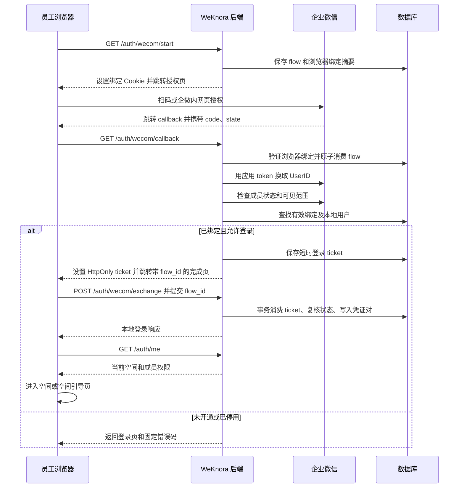

# 企业微信登录集成方案（拟实施）

> 状态：Proposed，尚未实现。本文中的新增接口、配置项、表结构和函数均为设计，不代表当前版本已经支持。
>
> 设计与审查基线：`origin/main`，提交 `1912ba26c544025adb869459a74c2cbac2a95cd9`，核对日期 2026-09-29。首期作为可选认证源设计，与既有本地账号和空间授权共存；实施和合并须单独完成代码与回归验收。
>
> 适用范围：公司内部使用的 WeKnora 服务器版 Web 服务，对接一个企业微信企业的自建应用。桌面浏览器和企业微信内置浏览器共用本地账号、会话、空间和知识库权限。当前部署配置、企业微信后台和真实账号尚未联调。

## 1. 结论与实施范围

建议在 WeKnora 内新增企业微信登录适配器，使用企业微信官方授权接口确认员工身份，再签发 WeKnora 自己的登录凭证。身份键采用 `provider=wecom + CorpID + UserID`，账号绑定与空间授权分别管理。

首期采用 **预建本地账号、管理员绑定、员工直接登录**：

1. 电脑浏览器登录页显示“企业微信登录”，跳转新版企业微信 Web 登录页面。
2. 员工从企业微信工作台打开应用，通过 `snsapi_base` 网页授权识别身份。
3. 后端校验所属企业、应用可见范围、成员状态、绑定状态和本地账号状态。
4. 已绑定员工进入原有账号；未绑定员工看到“此企业微信账号尚未开通，请联系管理员”。
5. 员工保留既有空间、知识库、会话和角色；没有可用空间时进入现有空间引导页。
6. 管理员可以预览绑定、确认绑定、暂停企微登录、解除绑定、停用本地账号，并查看审计记录。

首期不自动创建员工账号，不根据姓名、手机号或邮箱自动合并账号，不因为企微部门负责人身份自动授予管理员权限。首次登录建号、无邮箱账号、部门同步和自动离职处理分别在后续阶段实现，见第 13 节。

这一取舍使首期不依赖企业微信返回邮箱，也不必立即修改全站邮箱数据模型。**员工在企业微信没有邮箱不影响登录；但首期被绑定的本地账号仍须满足当前 WeKnora 的邮箱要求。** 管理员新建账号时应填写真实、经内部确认的邮箱。完全没有邮箱的员工必须等无邮箱账号能力完成，不能用伪造邮箱绕过。

已存在的邮箱账号直接绑定到原 `users.id`，不重新注册、不复制资源、不把邮箱字段改成 UserID。企微登录后的业务身份继续是 `PrincipalWebUser` / `web_user:<原 user_id>`；会话来源只是凭证元数据，不产生新的权限主体。首期既有邮箱密码和 OIDC 登录并存，功能默认关闭。

通用首期不改变 `auth.registration_mode`、`auth.default_tenant_mode`、空间 RBAC 开关或跨空间访问策略，不因启用企微而强制修改全站配置。单企业指一个服务实例对接一个企微认证源，**不限制该实例只能有一个 WeKnora 空间**。

## 2. 当前分支的能力与约束

以下路径均相对仓库根目录；函数名和提交号用于后续代码漂移时重新定位。

| 已核对位置 | 当前行为 | 对本方案的影响 |
|---|---|---|
| `internal/router/routes_auth_tenant.go`，`RegisterAuthRoutes` | 注册密码登录、OIDC 配置、授权、回调、刷新、登出等接口 | 在相同认证模块增加企微路由 |
| `internal/middleware/auth.go`，`noAuthAPI` / `isTenantOptionalAPI` | 公开接口采用路径与方法白名单；无空间用户另有身份接口白名单 | 新增公开接口必须登记；管理员和绑定接口不能整体放行 |
| `internal/handler/auth.go`，`OIDCRedirectCallback` | OIDC 回调完成本地登录；通过 URL fragment 携带编码后的登录结果 | 复用登录结果结构；企微采用独立的一次性交换流程 |
| `internal/application/service/user.go`，`LoginWithOIDC` | 按邮箱查本地用户；没有邮箱报错；未找到用户时自动建号 | 企微不能原样使用当前 OIDC 账号匹配逻辑 |
| 同上，`Register` | 用户名、邮箱、密码必填；默认可创建个人空间并设为 Owner | 企微首期不调用公开注册；后续建号必须明确指定空间策略 |
| `internal/types/user.go`，`User.Email` | 邮箱为非空、唯一的字符串字段 | 无邮箱自动开户需要独立迁移及全站兼容处理 |
| 同上，`UserPreferences.OidcOnlyLogin` | 描述的是 OIDC 初始随机密码对应的界面提示 | 不是服务端“禁止密码登录”的安全策略，不能挪作企微专用登录开关 |
| `internal/application/service/user.go`，`resolveLoginTenantID` / `buildMembershipsForUser` | 选择可用空间，生成成员关系返回值 | 提取共用的登录完成方法，避免企微自行拼装角色 |
| 同上，`generateTokensForTenant` | 当前 access token 为 24 小时，refresh token 为 7 天；两次 `CreateToken` 的错误被忽略 | 上线前改为成对、事务化保存，失败不能返回成功 |
| 同上，`ValidateToken` / `RefreshToken` | 检查 token 记录是否撤销并读取用户；已读路径未再次拒绝 `IsActive=false` | 要补充有效账号校验，才能承诺停用对存量会话生效 |
| 同上，`Logout` / `RevokeTokensByUserID` | 已有按用户撤销全部 token 的能力 | 本地账号停用可复用；仅暂停企微身份需补充按来源撤销 |
| `internal/application/service/tenant_member.go` / `internal/types/tenant_member.go` | 有 viewer / contributor / admin / owner 和成员状态 | 首期沿用既有成员关系；自动准入默认只能给 viewer |
| `frontend/src/views/auth/Login.vue` / `frontend/src/App.vue` | 登录和 OIDC 回调分别持久化会话 | 抽出共享会话落盘逻辑，企微完成页调用同一入口 |
| `frontend/src/router/index.ts` | 无空间用户进入 `/onboarding/workspace`；OIDC 回调有专门处理 | 企微完成页需先交换凭证，再执行普通路由守卫 |
| `internal/im/wecom/` | 企业微信聊天适配器支持 webhook / websocket | 聊天接入不会自动完成网站账号登录；首期登录凭据单独配置 |
| `internal/types/principal.go` / `internal/middleware/auth.go` | Web 用户、IM 用户和 API Key 等为独立 Principal | 企微网页登录仍使用原 Web 用户主体，不能用聊天 UserID 代替本地用户 |
| `internal/application/service/sandbox_terminal_auth.go` | 终端 / 桌面连接绑定签发它的 access token 记录；重校验不因正常 access token 到期而断开 | 外部身份停用检查需接入现有重校验；保留有效连接跨正常刷新存活的契约 |

以上均为静态源码结论，不代表当前线上容器正在运行同一版本，也不代表生产环境已开启严格空间 RBAC。

### 2.1 二次审查结果与通用 PR 边界

**结论：经以下修订，首期不存在与既有授权模型的原则性冲突，适合提交上游设计草案。原文不能直接当作功能已完成的 PR。**

| 编号 / 级别 | 发现的问题 | 修订决定 | 代码验收要求 |
|---|---|---|---|
| R1 / P1 | 仅说“复用用户”不足以保证历史会话、资源归属和 Principal 隔离一致 | 明确固定使用原 user_id 和 `PrincipalWebUser`，来源不是角色 | 同一邮箱账号从三种入口登录，资源和权限一致 |
| R2 / P1 | RefreshToken、SwitchTenant 现有签名没有凭证来源；仅增加表字段可能在衍生凭证时丢失企微来源 | 服务器读取当前认证记录，携带来源和绑定版本；客户端不能指定来源 | 刷新、切空间、邀请兑换后来源正确，旧 token 兼容 |
| R3 / P1 | “长连接停用另行实现”的原表述忽略了已存在的终端 / 桌面定时重校验 | 在既有重校验中增加来源状态判断，不改变其正常过期语义 | 绑定暂停后现有重校验拒绝；普通 token 到期但未撤销不误断开 |
| R4 / P1 | 只锁新企微入口无法解决共用签发、停用、重置密码等并发写入 | 将共用会话原子性和状态校验作为独立前置改动；变更要覆盖全部参与写入的方法 | 数据库竞争测试，不能只用顺序 mock 证明一致性 |
| R5 / P2 | 回调、数据表和后台流程描述缺少 Lite / API Key 边界 | 首期仅服务器版 Web；Lite 默认关闭且不改变 AutoSetup；管理绑定保持 JWT + SystemAdmin、API Key 默认拒绝 | Lite 原路径、API Key 能力矩阵无回归 |
| R6 / P2 | “管理员绑定后才能登录”容易被理解为修改全站注册 / 空间策略 | `bound_only` 仅作用于企微入口；其他认证和成员管理继续原策略 | self_serve / invite_only 两种配置均可运行 |
| R7 / P2 | 无邮箱开户、部门到空间同步、离职自动停用包含新的产品 / 授权决策 | 第 13 节只作为后续方向，不进入首期通用 PR | 不迁移邮箱约束、不写部门权限、不自动停用其他认证方式 |
| R8 / P2 | 部署专用策略和通用设计混在同一稿 | 对外稿使用上游基线、通用术语；公司策略留在部署说明 | PR diff 不包含品牌、同步脚本或公司员工数据 |

这里的“可提 PR”表示能提出一个范围明确、与当前模型相容的变更，并不表示维护者已经接受设计。一般维护成本或尚未实现的能力不等于授权冲突；无需因此复制一套私有认证系统。

上游实施建议拆为：A）共用会话可靠性 / 停用校验及独立测试；B）企微身份绑定与登录、前端及验收。B 依赖 A，不能在 A 缺失时声称支持来源撤销。设计草案 PR 只包含本文，不含 A / B 的代码。

## 3. 架构决定：ADR-WECOM-LOGIN-001

**状态：Proposed。决策参与者：项目负责人、后端负责人、企业微信管理员。**

### 3.1 方案比较

| 方案 | 工作内容 | 优点 | 代价 / 适用条件 |
|---|---|---|---|
| A：原生企微登录，复用本地会话（推荐） | 新增授权适配器、身份映射、回调交换、管理界面 | 单系统接入直接；账号和权限行为可控；不依赖邮箱匹配 | 自己维护企微接口、绑定和停用逻辑 |
| B：企业统一身份平台转 OIDC | 企微接身份平台，身份平台再接 WeKnora | 多系统共用登录与生命周期管理 | 若没有现成平台，会新增运维依赖；当前按邮箱自动绑定仍需审查 |
| C：只修改 OIDC 地址指向企微 | 试图用现有通用配置直连 | 表面改动少 | 当前 OIDC 的 code 换 token、用户信息和邮箱要求与企微接口不同，不能只换 URL |

采用 A。若公司已有可信的统一身份平台，可另行采用 B；本文不要求为了单个系统先搭建身份平台。

### 3.2 关键决定

| 编号 | 决定 | 原因 |
|---|---|---|
| D1 | 一套服务只配置一个 CorpID / AgentID | 首期公司内部场景清楚，不引入服务商多企业授权 |
| D2 | 身份唯一键为 provider + CorpID + 规范化 UserID | 邮箱、姓名和手机不适合作为自动绑定依据 |
| D3 | 首期仅允许已绑定账号登录 | 可控开通，避免登录成功意外创建个人空间或重复账号 |
| D4 | 本地账号和空间权限继续由 WeKnora 决定 | 企微确认员工身份，不等于授予知识库访问权 |
| D5 | 回调只设置短时 HttpOnly ticket，由前端 POST 换本地凭证 | 不把本地 access / refresh token 放进跳转 URL |
| D6 | 登录状态与 ticket 存数据库，企微应用 access_token 存共享缓存 | 登录安全状态可原子消费；多实例无需粘性会话 |
| D7 | 企微登录携带会话来源，刷新和切空间保留来源 | 暂停企微身份后仍能拦截该身份产生的存量会话 |
| D8 | 首期保留独立的本地管理员登录 | 企微接口或配置故障时仍可管理系统 |
| D9 | 服务器 Web 版可选启用；Lite 首期禁用 | 避免与桌面本地自动登录 / 配对流程混用 |

影响：新增 3 张小表和 token 来源字段；需要对公共签发 / 刷新路径做有限重构。业务问答、文档处理和检索流程继续使用现有认证上下文。后续同步部门或支持多企业时，必须重新评估身份语义、权限来源和接口授权。

## 4. 企业微信侧准备与已核对的协议

### 4.1 管理员配置

| 项目 | 建议值或操作 | 验证方式 |
|---|---|---|
| 应用类型 | 本企业自建应用，例如“企业知识助手” | 不使用智能机器人 `bot_id` / `bot_secret` 代替登录应用凭据 |
| 企业 / 应用凭据 | 获取 CorpID、AgentID、应用 Secret | 后端获取应用 token 后调用 `agent/get`，核对 AgentID 和 `close=0` |
| 可见范围 | 先开放测试员工，再逐步扩大 | 分别使用范围内、范围外员工测试 |
| Web 授权回调域 | 应用正式访问域名；按平台要求填写端口、不含协议和路径 | 与后端固定回调 URL 的 authority 一致 |
| 网页授权可信域名 | 同一正式访问域名，完成域名校验 | 实际从企微工作台打开并返回回调 |
| 企业可信 IP | 后端访问企微 API 的出口公网 IP | 容器、NAT、代理出口分别核对 |
| 工作台应用主页 | `https://<正式域名>/api/v1/auth/wecom/start?mode=oauth` | 企微桌面端、iOS、Android 实测 |
| HTTPS 与反向代理 | 前后端同源；代理只信任已配置的入口 | Host / Forwarded 伪造不能改变回调域 |

域名备案、主体关系和管理后台可配置条件须由管理员在实际后台核实；本文不假定现有域名已经满足平台条件。可信域名文件可以部署在域名根目录，但 Secret 不进入静态文件。

### 4.2 电脑端：新版 Web 登录

首期使用后端 302 跳转，减少前端组件依赖：

```text
https://login.work.weixin.qq.com/wwlogin/sso/login
  ?login_type=CorpApp
  &appid=<CORP_ID>
  &agentid=<AGENT_ID>
  &redirect_uri=<URL 编码后的固定回调地址>
  &state=<随机状态值>
  &lang=zh
```

官方已提供新版 Web 登录；后续需要内嵌登录面板时再接 `@wecom/jssdk`。2026-09-29 核对的文档要求组件使用 `>=2.3.2`，并说明快速登录存在客户端及浏览器条件，因此首期不承诺所有电脑都出现快速登录。参见 [Web 登录组件](https://developer.work.weixin.qq.com/document/path/98152)及[开始开发](https://developer.work.weixin.qq.com/document/path/98151)。

### 4.3 企业微信内：网页授权

```text
https://open.weixin.qq.com/connect/oauth2/authorize
  ?appid=<CORP_ID>
  &redirect_uri=<URL 编码后的固定回调地址>
  &response_type=code
  &scope=snsapi_base
  &state=<随机状态值>
  &agentid=<AGENT_ID>
  #wechat_redirect
```

`snsapi_base` 用于取得基础身份，首期不为登录索取手机号、头像或邮箱。`state` 采用 32 字节随机数的十六进制编码，共 64 个字母数字字符，满足文档的字符和 128 字节长度限制。浏览器识别仅用于选择登录入口，不参与身份或权限判断。[官方网页授权说明](https://developer.work.weixin.qq.com/document/path/91022)

### 4.4 后端取得身份

```text
GET https://qyapi.weixin.qq.com/cgi-bin/gettoken
    ?corpid=<CORP_ID>&corpsecret=<APP_SECRET>

GET https://qyapi.weixin.qq.com/cgi-bin/auth/getuserinfo
    ?access_token=<APP_ACCESS_TOKEN>&code=<AUTH_CODE>

GET https://qyapi.weixin.qq.com/cgi-bin/user/get
    ?access_token=<APP_ACCESS_TOKEN>&userid=<USER_ID>
```

Web 登录和网页授权的当前文档都指向 `auth/getuserinfo`。授权码只能使用一次，未使用时 5 分钟过期。身份接口返回小写 `userid`；非企业成员可能只有 `openid` / `external_userid`，后端必须拒绝把这些字段当内部员工 ID。[Web 身份接口](https://developer.work.weixin.qq.com/document/path/98176)、[网页授权身份接口](https://developer.work.weixin.qq.com/document/path/91023)

**只取得 UserID 还不够。** 身份接口可能返回不在应用可见范围内的企业成员。两种登录入口都应继续使用同一应用 token 调用 `user/get`，以可读取该成员、`status=1`、本地绑定有效作为准入条件。`agent/get` 的应用状态可短时缓存，初始建议最长 60 秒；成员状态在每次新登录时重新检查。通讯录读取失败、状态缺失、应用停用或校验不完整时拒绝本次登录，不凭旧资料放行。

官方说明新建自建应用读取成员时通常不直接返回邮箱、手机号等敏感字段；UserID 在企业内不区分大小写。保存原始值用于显示 / 调用，另存规范化值用于唯一约束。上下游 / 企业互联可能返回带企业前缀的身份；首期仅本企业，拒绝不符合本企业成员身份契约的返回值。[读取成员](https://developer.work.weixin.qq.com/document/path/90196)、[获取应用](https://developer.work.weixin.qq.com/document/path/90363)

## 5. 登录和管理流程

### 5.1 登录时序



### 5.2 已有员工开通

1. 系统管理员进入拟新增的“企业微信登录 → 员工账号”页面。
2. 选择一个明确的本地 `user_id`，填写员工企业微信 UserID。
3. 后端调用 `user/get`，返回本地账号信息和企微姓名 / UserID 的并排预览；若姓名不可得，显示 UserID，不能编造姓名。
4. 管理员核对后确认绑定。预览生成 5 分钟有效的签名摘要，包含目标双方 ID、版本号与管理员 ID；确认时重新检查双方状态和唯一约束。
5. 事务创建绑定和审计记录；成功后员工即可登录原账号。
6. 如需加入新空间，由有权管理该空间成员的人员完成既有成员分配。绑定操作本身不增加空间权限。

同名员工不自动匹配；修改 UserID、删除后重新使用同一账号标识、员工离职后重新入职，都走人工复核。数据库不能自动判断“相同 UserID 是否仍为同一个自然人”。

### 5.3 异常时的用户行为

| 状态 | 页面文案 | 后续动作 |
|---|---|---|
| 未绑定 | 此企业微信账号尚未开通，请联系管理员 | 显示联系提示和请求编号，不暴露其他用户的账号列表 |
| 不在范围 / 非内部成员 | 当前账号没有此应用的访问权限 | 返回登录页 |
| 本地账号停用 | 此账号已停用，请联系管理员 | 不签发 ticket 或本地凭证 |
| 授权过期 / state 无效 | 登录已过期，请重新登录 | 明确按钮重新发起，禁止无限自动跳转 |
| 企微暂时不可用 | 企业微信登录暂时不可用，请稍后重试 | 保留既有本地登录入口 |
| 没有空间 | 你还没有加入空间，请联系管理员 | 使用现有空间引导页及部署策略 |
| 绑定冲突 | 该企业微信账号已绑定其他账号，请先核对 | 管理员操作返回 409；不覆盖旧绑定 |

## 6. 数据模型与一致性

### 6.1 外部身份表 `external_identities`

建议 PostgreSQL 结构如下。它是设计示例，正式迁移编号取实施时的下一可用编号。

```sql
CREATE TABLE external_identities (
    id                    VARCHAR(36) PRIMARY KEY,
    provider              VARCHAR(32) NOT NULL,
    corp_id               VARCHAR(128) NOT NULL,
    external_user_id       VARCHAR(128) NOT NULL,
    external_user_id_norm  VARCHAR(128) NOT NULL,
    user_id               VARCHAR(36) NOT NULL REFERENCES users(id),
    status                VARCHAR(16) NOT NULL DEFAULT 'active',
    binding_method        VARCHAR(32) NOT NULL,
    bound_by              VARCHAR(36) NOT NULL,
    version               BIGINT NOT NULL DEFAULT 1,
    last_login_at         TIMESTAMPTZ,
    verified_at           TIMESTAMPTZ,
    created_at            TIMESTAMPTZ NOT NULL DEFAULT CURRENT_TIMESTAMP,
    updated_at            TIMESTAMPTZ NOT NULL DEFAULT CURRENT_TIMESTAMP,
    CONSTRAINT external_identity_status
        CHECK (status IN ('active', 'suspended', 'revoked')),
    CONSTRAINT external_identity_key
        UNIQUE (provider, corp_id, external_user_id_norm),
    CONSTRAINT external_identity_local_key
        UNIQUE (provider, corp_id, user_id)
);
```

规则：

- CorpID 从服务端当前配置获得，不能采信回调 query 中的企业 ID。
- UserID 以官方返回为准，校验格式后规范化大小写；原始值保留用于 API 调用。
- 首期一个本地账号在同一企业只绑定一个企微成员，避免含糊的多身份解绑行为。
- 暂停与解除绑定均保留记录及唯一约束；普通登录不能把已撤销绑定当作“从未绑定”而自动重建。
- 纠正错误绑定使用专门的管理员操作，在同一事务中锁定绑定和涉及用户、校验版本、撤销旧会话、写审计，再更新绑定。唯一键冲突必须返回 409。
- 本地用户软删除后，绑定保持不可用，不自动转移到其他账号。
- 不存企微 Secret、应用 access_token、code、员工手机号或完整通讯录响应。

### 6.2 登录流程表 `auth_login_flows`

| 字段 | 类型 / 约束 | 用途 |
|---|---|---|
| `id` | UUID 字符串，主键 | 内部流程标识 |
| `state_hash` | 64 位 SHA-256 hex，唯一 | 只保存 state 摘要 |
| `browser_binding_hash` | 64 位摘要 | 绑定发起登录的浏览器 Cookie |
| `provider` / `mode` | `wecom`、`web` 或 `oauth` | 由服务端保存，回调不能改模式 |
| `config_version` | 字符串 | 绑定此次流程使用的企业 / 应用配置版本 |
| `return_path` | 服务端允许的站内路径 | 首期只允许知识库首页或空间引导页 |
| `created_at` / `expires_at` | 时间戳 | 初始 TTL 5 分钟 |
| `consumed_at` | 可空时间戳 | 原子单次消费 |

回调使用条件更新或事务行锁，要求未过期、未消费、浏览器摘要一致，再原子标记已消费。网络调用在消费成功后进行，不持有数据库事务等待企微响应。授权请求失败后重新发起登录；不恢复已经消费的 state。

### 6.3 一次性登录表 `auth_login_tickets`

| 字段 | 类型 / 约束 | 用途 |
|---|---|---|
| `id` | UUID 字符串，主键 | 内部记录 ID |
| `ticket_hash` | 64 位摘要，唯一 | 随机 ticket 原文只在 HttpOnly Cookie 中 |
| `flow_id` | 外键或受约束关联，唯一 | 一次 flow 最多生成一个 ticket |
| `external_identity_id` / `user_id` | 绑定和用户 ID | 交换时重新读取，不信任陈旧对象 |
| `identity_version` / `config_version` | 版本号 | 绑定或配置改变后旧 ticket 失效 |
| `browser_binding_hash` | 64 位摘要 | 限制 ticket 在原浏览器交换 |
| `expires_at` / `consumed_at` | 时间戳 | 初始 TTL 60 秒，单次消费 |

ticket 的消费、身份复核、本地 token 对插入应在同一个数据库事务中提交。任一步失败不返回有效凭证，避免“ticket 已用但只存了一半 token”。已消费 ticket 的重放一律失败；响应丢失时重新登录，不返回之前保存的明文凭证。

流程和 ticket 按过期时间建立索引，后台每 10 分钟清理超过保留窗口的记录，初始保留窗口 24 小时。审计另表保留。SQLite 版本应使用相应时间类型，并通过条件更新的影响行数实现单次消费；不能照搬 PostgreSQL 行锁语法。

### 6.4 本地凭证来源

给 `auth_tokens` 增加：

```sql
ALTER TABLE auth_tokens
    ADD COLUMN auth_method VARCHAR(32) NOT NULL DEFAULT 'legacy';
ALTER TABLE auth_tokens
    ADD COLUMN external_identity_id VARCHAR(36)
    REFERENCES external_identities(id);
ALTER TABLE auth_tokens
    ADD COLUMN external_identity_version BIGINT;
ALTER TABLE auth_tokens
    ADD COLUMN session_family_id VARCHAR(36);
CREATE INDEX idx_auth_tokens_external_identity
    ON auth_tokens (external_identity_id);
```

既有 token 保持 `legacy`，不根据邮箱推断其来源。新签发支持 `password`、`oidc`、`wecom`；企微 token 的 `external_identity_id` 必须存在且属于该用户，同时保存签发时的绑定版本。来源信息以服务端 token 记录为准，不能由客户端提交决定。

每次验证企微凭证都要求绑定 active、绑定 user_id 与 token user_id 一致、版本一致。暂停、恢复、解绑和重绑都递增版本；恢复绑定只能签发新会话，不能让旧会话恢复有效。非企微来源保留原策略，不要求存在企微身份记录。

新增签发时为每个 JWT 放入随机 `jti`，避免同一用户同一秒多次签发得到相同 token 字符串，导致按值撤销语义含糊。access / refresh 两条记录必须事务化保存；刷新采用单次条件消费旧 refresh 记录，成对保存新 token，保持原始身份来源。切换空间同样保留来源。

保留既有 `/auth/refresh` 请求字段 `refreshToken` 和成功响应结构，不强制旧客户端改用新的登录 DTO。新签发的凭证对共享服务端生成的 `session_family_id`，刷新和切空间保留该值；既有凭证保持 null，不根据时间或邮箱猜测配对。

`SwitchTenant` 的来源取自通过认证的 access token 记录；如请求同时携带旧 refresh token，新凭证要求同一用户、认证来源和 session family。对两者均为 legacy 的兼容路径，至少校验用户、token 类型、有效状态，并禁止继承企微来源。客户端不能自报来源或 family ID，也不能通过提交另一用户的 refresh token 使其被撤销。

## 7. 后端接口契约

下列路径统一带 `/api/v1` 前缀。除明确列出的公开接口外，均要求有效本地 JWT；管理接口还要求 SystemAdmin，API Key 默认禁止访问。

### 7.1 公开登录接口

| 方法与路径 | 输入 / 输出 | 约束 |
|---|---|---|
| `GET /auth/wecom/config` | `{enabled, display_name, web_enabled, oauth_enabled}` | 不返回 Secret、应用 token 或配置详情 |
| `GET /auth/wecom/start?mode=web` | 创建 flow，设置浏览器绑定 Cookie，302 到企微 | `mode` 仅允许 web / oauth；不接受任意回调 URL |
| `GET /auth/wecom/callback` | 接受 `code`、`state`；成功设置 ticket Cookie 并 303 到带 `flow_id` 的完成页 | 必须校验并消费 flow；拒绝重复参数、超长值和模式篡改 |
| `POST /auth/wecom/exchange` | JSON `{flow_id}`；从 Cookie 取 ticket，返回当前登录 DTO | 同源 Origin、flow 匹配、Cookie 绑定、单次消费、限流 |

成功响应调用 `dto.NewAuthLoginResponse`，与现有密码登录一致，包含 `success`、`user`、`active_tenant`、`memberships`、`token`、`refresh_token`。现有 OIDC DTO 使用 `tenant` 字段，前端共用入口需要兼容这个差异，但企微新接口统一返回 `active_tenant`。序列化契约位于 `internal/handler/dto/auth.go`，不能直接输出包含更多内部字段的 service 对象。企微特有的错误采用固定机器码和本地化文案。

callback 不直接渲染包含第三方资源的 HTML；失败只跳回固定 `/login?auth_error=<允许的错误码>`。禁止把企微原始 `errmsg`、code、Secret 或 token 拼入返回地址。

### 7.2 管理接口

| 方法与路径 | 作用 | 特别要求 |
|---|---|---|
| `GET /system/admin/auth/wecom/status` | 查看启用状态、配置版本和最近连通性结果 | Secret 只返回 `configured=true/false` |
| `POST /system/admin/auth/wecom/check` | 检查应用凭据、AgentID、应用启用状态 | 主动检查，严格限频；不获取全公司通讯录 |
| `GET /system/admin/auth/wecom/identities` | 分页搜索本地绑定 | 分页上限 100；只返回业务必要字段 |
| `POST /system/admin/auth/wecom/bindings/preview` | 输入 `user_id` 和 `wecom_user_id`，返回两侧账号预览及短时签名摘要 | 确认本地用户存在且未停用 |
| `POST /system/admin/auth/wecom/bindings` | 提交预览摘要及版本，创建绑定 | 重查状态；相同绑定幂等返回；冲突返回 409 |
| `PATCH /system/admin/auth/wecom/identities/:id` | 暂停 / 恢复企微身份 | 版本条件写；暂停时撤销该身份全部 token |
| `POST /system/admin/auth/wecom/identities/:id/revoke` | 解除绑定 | 保留占位和审计；撤销来源会话 |
| `POST /system/admin/auth/wecom/identities/:id/rebind` | 经复核后纠正绑定 | 锁定旧 / 新用户，限制旧会话残留和并发覆盖 |
| `POST /system/admin/users/:id/disable` | 停用本地账号并撤销全部会话 | 不允许停用自己或最后一个可用系统管理员 |

首期单条绑定即能完整开通员工；批量 CSV 导入作为可选改进。批量导入必须先预览、输出冲突清单，再按稳定幂等键提交，并逐条回读结果，不做模糊匹配。

### 7.3 错误码建议

| 错误码 | 建议 HTTP 状态 | 含义 |
|---|---|---|
| `WECOM_DISABLED` | 403 | 入口未启用 |
| `WECOM_STATE_INVALID` | 400 | 流程无效、过期或重复 |
| `WECOM_BROWSER_MISMATCH` | 400 | 发起和回调浏览器不一致 |
| `WECOM_ACCESS_DENIED` | 403 | 非本企业成员、不在范围或成员不可用 |
| `WECOM_BINDING_REQUIRED` | 403 | 有企微身份，但本地未开通 |
| `WECOM_BINDING_CONFLICT` | 409 | 已绑定其他用户或记录版本冲突 |
| `ACCOUNT_DISABLED` | 403 | 本地账号停用 |
| `WECOM_TICKET_INVALID` | 401 | ticket 过期、已使用或不匹配 |
| `WECOM_UPSTREAM_UNAVAILABLE` | 503 | 企微 API 调用失败 |

callback 的 HTTP 输出是受控跳转，错误码附在站内返回地址；表中状态用于 JSON 接口。管理界面可看到经过脱敏的上游错误码和请求编号，员工界面只显示可操作的提示。

## 8. 配置、Cookie 与企微客户端

### 8.1 拟新增配置

```yaml
wecom_auth:
  enable: false
  display_name: 企业微信
  corp_id: ""
  agent_id: ""
  public_origin: ""             # 如 https://ai.example.com，必须是正式固定 Origin
  callback_path: /api/v1/auth/wecom/callback
  provisioning_mode: bound_only
  web_enabled: true
  oauth_enabled: true
  state_ttl_seconds: 300
  ticket_ttl_seconds: 60
  app_status_cache_seconds: 60
```

以上字段尚不存在，需要在 `internal/config/config.go`、配置加载 / 校验和 `config/config.yaml` 实现。拟定环境变量为 `WEKNORA_WECOM_AUTH_ENABLE`、`WEKNORA_WECOM_AUTH_CORP_ID`、`WEKNORA_WECOM_AUTH_AGENT_ID`、`WEKNORA_WECOM_AUTH_SECRET`、`WEKNORA_WECOM_AUTH_PUBLIC_ORIGIN`；示例文件只写变量名和空值。

首期 Secret 通过现有部署的私密环境变量机制注入，重启应用后生效；管理页不提供 Secret 明文编辑和读取。后续若改为数据库配置，需要单独设计加密、密钥轮换、脱敏和审计，不能只给普通 KV 标记一个名称。

启用时缺少必要字段、Origin 非 HTTPS、路径不在允许集合、回调包含用户信息或查询参数，应启动校验失败；禁用时允许空值。Origin 只能来自服务端配置，不能使用不受信任的 `Host` / `X-Forwarded-Host` 拼接。

### 8.2 Cookie 和浏览器约束

| Cookie | 值 | 属性与有效期 |
|---|---|---|
| `__Host-weknora_wecom_browser` | 随机浏览器绑定值 | HttpOnly、Secure、SameSite=Lax、无 Domain、Path=`/`、10 分钟 |
| `__Host-weknora_wecom_ticket` | 随机 ticket 原文 | HttpOnly、Secure、SameSite=Lax、无 Domain、Path=`/`、60 秒 |

采用 `__Host-` 前缀及其要求的 Path=/，阻止兄弟子域通过 Domain Cookie 覆盖同名绑定值。服务端仅在企微登录端点读取它们，交换时仍需同源与 flow 校验；日志层统一过滤 Cookie。验收浏览器对前缀的实际支持，不能把浏览器前缀保护当成唯一的 CSRF 防线。

浏览器绑定值不存在时才生成，短时间重复发起不覆盖有效值；各 flow 用独立 state，可支持多个标签页同时授权。完成页固定为 `/login/wecom/complete?flow_id=<服务端生成的 UUID>`，该 ID 仅用于关联流程，持有它不能交换凭证。前端必须将当前页面的 `flow_id` 提交给 exchange，后端校验它与 Cookie ticket 的 `flow_id` 一致。

ticket Cookie 只能保存最后完成的一次登录，多标签页采用“后完成者有效”。旧页面与新 Cookie 的 flow 不匹配时只拒绝该次交换，不清除 / 消费新 ticket，避免旧页面把另一登录流程当成自己的结果。完成后清理地址中的 flow_id；同一浏览器最终仍共享本地会话，界面应同步当前账号变化。

`exchange` 同时验证：正确的 Origin、合法内容类型、flow_id、ticket、浏览器绑定摘要、ticket 有效期和身份版本。仅配置 SameSite 不能替代这些校验。登录相关响应设置 `Cache-Control: no-store` 和 `Referrer-Policy: no-referrer`；消费后以相同 Path 删除 ticket Cookie。并发回调与交换可能造成浏览器 Cookie 最终写入顺序变化，安全目标是拒绝错误流程，受影响页面提示重新登录；不保证多个不同账号在同一浏览器并行登录成功。

浏览器拒绝 Cookie、跨设备打开回调或在扫码手机上打开电脑回调地址，均不降级为免绑定登录，应提示重新开始。前后端跨域部署不在首期范围内。

### 8.3 应用 access_token 管理

企微应用 access_token 与 WeKnora 用户 access token 是两类凭证：前者只能在后端用于调用企微 API，不能返回给前端，也不能当本地登录 token。

缓存键包含环境、CorpID、AgentID 和 Secret 配置版本，防止不同应用互用；缓存有效期根据上游 `expires_in` 设置并提前约 120 秒刷新。若返回寿命短于安全窗口，立即进入刷新策略，不能产生负 TTL。使用进程内 singleflight 加共享缓存锁减少多实例重复刷新。

仅遇到明确的应用 token 失效错误时刷新并重试一次；网络超时后不能无限重放一次性的登录 code，因为它可能已经被上游消费。必要时终止本次登录并请员工重新授权。HTTP 客户端设置超时、响应大小上限、不跟随跨主机重定向；生产主机固定为官方域名，测试用依赖注入替换。

官方应用 token 通常为 7200 秒，但可能提前失效，必须按返回值与错误处理缓存。[获取 access_token](https://developer.work.weixin.qq.com/document/path/91039)

## 9. 后端实现拆分

### 9.1 新增与修改文件

| 文件 / 目录 | 建议职责 |
|---|---|
| `internal/auth/wecom/client.go`（新增） | 获取应用 token、换取身份、读取成员、读取应用；只处理企微协议 |
| `internal/auth/wecom/token_cache.go`（新增） | 缓存、刷新、并发合并；与登录 flow 存储分离 |
| `internal/types/external_identity.go`（新增） | 身份、flow、ticket、会话来源类型 |
| `internal/types/interfaces/external_identity.go`（新增） | 仓储和登录服务契约 |
| `internal/application/repository/external_identity.go`（新增） | 绑定查询、唯一约束、版本更新 |
| `internal/application/repository/auth_login_flow.go`（新增） | flow 原子消费、ticket 事务消费、过期清理 |
| `internal/application/service/wecom_auth.go`（新增） | 登录编排、成员准入、绑定判断、ticket 管理 |
| `internal/application/service/external_identity.go`（新增） | 管理员预览、绑定、暂停、纠正、审计 |
| `internal/handler/auth_wecom.go`（新增） | 公开 HTTP 路由处理、Cookie、重定向、错误码 |
| `internal/handler/system_wecom_auth.go`（新增） | 管理接口；不混入原聊天 webhook |
| `internal/application/service/user.go`（修改） | 共用登录结果生成、账号状态校验、事务签发、来源保留 |
| `internal/application/repository/user.go`（修改） | token 对事务写入、按外部身份撤销、单次刷新 |
| `internal/application/service/sandbox_terminal_auth.go`（修改） | 在现有终端 / 桌面重校验中检查来源身份与版本，保留 token 过期处理约定 |
| `internal/handler/dto/auth.go`（按需修改） | 保持密码 / OIDC / 企微登录返回契约一致 |
| `internal/middleware/auth.go`（修改） | 精确公开路径白名单、来源状态校验衔接 |
| `internal/router/routes_auth_tenant.go`（修改） | 公开认证及受 SystemAdmin 保护的管理路由 |
| `internal/container/container.go`（修改） | 仓储、客户端、服务和 handler 依赖注入 |
| `internal/types/audit_log.go`（修改） | 登录、绑定、暂停、解除、停用事件 |
| `migrations/versioned/`、`migrations/sqlite/`（新增迁移） | 新表与来源字段；按各自版本序列分配编号 |
| `config/config.yaml`、`.env.example`、`docker-compose.yml`（按需修改） | 配置声明、私密环境变量传递 |

### 9.2 服务边界示意

```go
// 拟新增契约，示例省略项目统一错误和 DTO 类型的具体定义。
type WeComClient interface {
    ExchangeCode(ctx context.Context, code string) (WeComIdentity, error)
    GetMember(ctx context.Context, userID string) (WeComMember, error)
    GetApplication(ctx context.Context) (WeComApplication, error)
}

// 这是认证凭证的来源上下文，不替代 types.Principal。
// 业务层仍接收 PrincipalWebUser 和原有本地 UserID。
type LoginCredentialContext struct {
    UserID             string
    AuthMethod         string // 服务端确定
    ExternalIdentityID string // 企微登录必须设置
    IdentityVersion    int64
}

// 应放在共用登录服务中：读取用户、复核身份、解析空间、
// 原子写 token 对并构造与现有登录一致的响应。
// ExchangeTicket 的事务需要与该方法共享 UnitOfWork，
// 不能调用一个独立提交的 GenerateTokens 再事后标记 ticket。
type LoginSessionService interface {
    ExchangeTicket(ctx context.Context, flowID, ticket, browserBinding string) (LoginResult, error)
    Refresh(ctx context.Context, refreshToken string) (LoginResult, error)
}
```

建议复用现有 service / repository 分层，但必须新增明确的事务入口或 UnitOfWork：绑定、ticket、token 和身份状态检查使用同一事务句柄。不要仅把 `context.Context` 传下去就假定现有仓储自动加入事务。

### 9.3 回调与交换伪代码

```text
Callback(code, state, browserCookie):
  检查 enable、参数长度、固定配置版本
  原子领取未过期 flow，并校验浏览器摘要
  调用企微 auth/getuserinfo
  要求返回本企业内部 userid
  用同应用凭证读取成员和应用状态
  要求成员 active、应用启用、可读取该成员
  查询已激活绑定和已激活本地账号
  生成一次性 ticket，关联绑定版本与浏览器
  设置 HttpOnly Cookie，303 到固定完成页并携带非凭证 flow_id

Exchange(flowID, ticketCookie, browserCookie, origin):
  检查同源请求并开启事务
  按统一锁顺序锁定用户、绑定、ticket
  复核 flow 匹配、未过期未消费、用户有效、绑定有效、版本一致
  选择当前有效空间，构造服务端 memberships
  生成有随机 jti 的 access / refresh token
  在同一事务中保存来源、token 对、ticket 消费状态
  提交成功后返回登录 DTO；失败则回滚
```

所有暂停、解绑、本地停用、刷新、空间切换及 ticket 交换遵循相同锁顺序。两个本地用户参与纠正绑定时按用户 ID 排序加锁。否则“停用与登录同时发生”可能在撤销后又签发新会话。

共用路径还须覆盖密码 / OIDC / 邀请登录、管理员重置密码和注销中相关的凭证写入；Lite AutoSetup 保留行为并参与签发回归。事务中涉及空间选择的读取 / 更新必须使用相同事务仓储，不能持有用户锁后再调用另一连接更新同一用户，造成自锁。PostgreSQL 使用数据库竞争测试；SQLite 使用写事务和条件更新，分别验证锁与重试行为。

HTTP 认证、沙箱 terminal / desktop 的父 token 重校验应调用同一个“账号和来源仍有效”判断；它不隐式检查到期时间，到期与否由调用场景按现有契约决定。业务 Principal 始终由现有 middleware 填充，不把 `LoginCredentialContext` 当作授权上下文。

## 10. 前端与真实使用路径

1. `Login.vue` 拉取 `/auth/wecom/config`，只有后端明确启用才显示企微按钮。配置请求失败时隐藏该入口并保留原有登录。
2. 电脑端按钮打开同源 `start?mode=web`；企业微信内使用 `start?mode=oauth`。首期不内嵌第三方脚本，不要求微信 JS-SDK 的一般网页签名配置。
3. 新增 `/login/wecom/complete` 页面：只显示“正在登录”，携带页面的 `flow_id` POST `exchange`，不从 query / fragment 读取本地 token。
4. 将当前 `Login.vue` 和 `App.vue` 的共同会话持久化提取为一个可测试入口；统一写 user、token、refreshToken、memberships、当前空间并清理上一用户资源缓存。
5. 完成后调用现有 `/auth/me` 刷新服务端状态，再进入目标页面。无空间进入 `/onboarding/workspace`；没有创建空间权限的员工只看到加入 / 联系提示。
6. 路由守卫允许未登录用户访问企微完成页，避免先被送回 `/login`；交换失败后显示固定错误并提供重新登录，不自动循环授权。
7. 为管理员新增 `frontend/src/views/system/WeComAuth.vue`、对应 `frontend/src/api/system/wecomAuth.ts` 和导航入口。普通员工不能看到绑定列表。
8. 保留邀请链接行为：入口如携带已有邀请 token，应使用既有 `sessionStorage` 保存机制，登录成功后走现有邀请兑换接口；不得把邀请值透传给企微 state 或用它替代准入校验。
9. 文案放入现有 i18n 目录。检查加载、过期、重试、权限不足、绑定冲突、键盘操作和小屏布局。

前端显示管理员、角色或绑定状态只用于界面；权限决定由服务端执行。现有 token 存储机制仍沿用项目实现，整体改成 Cookie 会话属于另一项独立改造。

## 11. 权限、停用与审计

### 11.1 空间与知识库

- 首期绑定不修改 `users.tenant_id` 或 `tenant_members`，不自动创建个人空间。
- `IsSystemAdmin` 与 `CanAccessAllTenants` 不从企微部门、标签、职位或负责人字段推导。
- 部署必须核实 `WEKNORA_TENANT_ENABLE_RBAC` 的实际生效值，跨空间访问也必须核实；仅看前端菜单不足以证明隔离。
- 验收必须尝试直接访问另一空间已知知识库 ID、Agent ID、会话 ID，验证服务端拒绝。
- viewer 能否运行某个 Agent 取决于既有 Agent 配置；“能登录”不能作为“全部问答入口可用”的证明。

### 11.2 停用语义

| 操作 | 新的企微登录 | 已签发的企微会话 | 其他登录方式 |
|---|---|---|---|
| 关闭企微登录开关 | 拒绝 | 默认继续有效；紧急处置另行撤销全部企微来源 token | 保持原策略 |
| 暂停 / 解除一个企微身份 | 拒绝 | 来源状态检查及撤销使后续请求、刷新失败 | 本地账号仍有效时可继续使用 |
| 停用本地员工账号 | 拒绝 | 撤销全部 token，且每次验证 / 刷新检查 `IsActive` | 密码 / OIDC 等同样拒绝 |
| 从企微应用可见范围移除 | 下次企微登录拒绝 | 首期不会自动感知，需管理员同步暂停或停用 | 不自动改变 |
| 删除 / 禁用企微员工 | 下次企微登录拒绝 | 首期需人工停用本地账号；自动同步在后续阶段 | 不自动改变 |

**首期离职操作必须包含 WeKnora 本地停用步骤。** 单纯关闭企微应用或删除成员，不能承诺已经签发的本地凭证立即失效。停用在后续请求生效；已有沙箱 terminal / desktop 重校验路径必须在其既定检查周期内拒绝已撤销父 token、停用账号或无效外部身份。保留正常 access token 到期不主动中断既有 PTY 的行为。其他 SSE / WebSocket 以及已排队任务的主动取消需单独实现，首期不承诺统一实时终止。

本地停用接口要事务化更新用户状态和撤销 token，并阻止最后一个有效系统管理员被停用。恢复员工账号须经过管理员复核，不因某次企微查询恢复成功而自动启用本地账号。

### 11.3 审计和运行指标

新增事件建议：`auth.wecom.login_succeeded`、`auth.wecom.login_failed`、`auth.identity.bound`、`auth.identity.suspended`、`auth.identity.revoked`、`auth.identity.rebound`、`auth.user.disabled`。

记录时间、请求编号、操作人、本地 user_id、身份记录 ID、结果、固定原因码、必要的来源 IP 和配置版本；不记录 code、Cookie、ticket、Secret、应用 token、本地 token 或完整上游响应。代理 access log 对 callback 查询串脱敏，错误日志也不能输出包含凭据的完整企微请求 URL。

绑定 / 纠正 / 停用的审计与状态写入同一事务，作为可追溯管理操作；普通登录结果沿用现有审计服务并监控写入失败。现有审计服务调用方通常忽略写入错误，不能因此宣称管理操作已经具备事务审计。

指标包括成功率、各阶段耗时、上游错误码分布、state / ticket 重放拒绝量、缓存命中率、审计失败数。指标标签不放员工 ID，避免泄露身份及高基数。

## 12. 首期实施计划与验收

### 12.1 开发顺序

| 阶段 | 工作与交付物 | 完成条件 | 粗略投入 |
|---|---|---|---|
| P0：条件验证 | 测试自建应用、固定回调域、可信 IP、2 个正常成员和 1 个范围外成员 | 两种入口取得身份；证明 `user/get` 的范围和 status 行为；不依赖邮箱 | 0.5～1 人日 |
| P1：基础数据和会话 | 三张表、来源字段、账号状态校验、事务签发 / 刷新 | 迁移、并发消费、停用与签发竞争测试通过 | 2～3 人日 |
| P2：授权和绑定 | 企微客户端、缓存、state、callback、ticket、管理接口 | 已绑定可登录，未绑定和范围外拒绝，重放失败 | 2～3 人日 |
| P3：前端完整路径 | 登录按钮、完成页、管理员绑定页、现有空间引导和邀请兼容 | 开通、登录、刷新、切空间、退出、停用可闭环操作 | 1～2 人日 |
| P4：联调与发布 | 真机、多浏览器、权限回归、故障演练、部署说明 | 第 12.3 节的首期验收全部通过 | 1～2 人日 |

按一名熟悉 Go / Vue 和此仓库的开发者估算，首期可上线版本约 **6.5～11 人日**，不含企业域名条件处理和管理员等待时间。只跑通一次登录的原型可以更快，但不包含绑定、停用、刷新竞争和权限回归。每个阶段开始前重查依赖，不把 P0 的关键平台条件推迟到上线前。

### 12.2 自动化测试矩阵

| 层级 | 必测场景 |
|---|---|
| 客户端单元测试 | 参数编码；上游 errcode；缺少 userid；仅有 openid；超时；响应过大；应用 token 失效后仅刷新一次；日志脱敏 |
| 身份 / 仓储 | UserID 大小写归一；唯一冲突；同绑定幂等；暂停 / 解除 / 纠正；乐观版本冲突；软删除用户；事务审计失败回滚 |
| flow / ticket | state 过期、重复、浏览器不符、配置变更；ticket 单次消费；两次并发交换最多一次成功；数据库失败不泄露 token |
| 凭证生命周期 | token 对写入失败；并发刷新；来源保留；切空间来源保留；拒绝其他用户 / 会话的 refresh；停用后旧 access 和 refresh 失效；恢复绑定不恢复旧 token；签发与停用并发 |
| HTTP / 中间件 | 正确白名单；不允许任意 redirect；Host 伪造；Origin 不符；Cookie 属性；API Key 无法管理绑定；tenantless 用户路径 |
| 现有功能回归 | 密码登录、OIDC、退出、邀请、换空间、管理员恢复入口；旧 legacy token、Lite AutoSetup 和原有刷新响应兼容；IM / API Key Principal 隔离 |
| 沙箱连接 | terminal / desktop 的签票、握手、周期重校验；来源停用后拒绝；正常 access token 过期 / 刷新不误断开；不泄露父 token |
| 前端 | config 失败；callback 不被提前拦截；清理旧账号缓存；多标签页；过期重试；空间引导；邀请 token 恢复 |
| 数据库 | PostgreSQL 正式路径和 SQLite 迁移 / 条件消费；从现有库升级与空库安装；时间统一为 UTC |

实施后执行仓库当前支持的测试命令，按改动包分层运行；示意如下：

```bash
# 在仓库根目录；新增目录完成后再运行这些命令。
go test ./internal/auth/wecom/... ./internal/application/repository/... \
  ./internal/application/service/... ./internal/handler/... \
  ./internal/middleware/... ./internal/router/...

# 在 frontend 目录；具体脚本以当时 package.json 为准。
npm test
npm run type-check
npm run build
```

这些是未来功能实现的验收命令，本文编写阶段没有运行功能测试，也不能将文档校验视为登录功能通过。

### 12.3 真实账号验收清单

- [ ] 电脑 Chrome / Safari 扫码后进入正确本地账号，刷新页面仍有效。
- [ ] 企业微信桌面端、iOS、Android 从工作台打开均完成身份识别，不出现跳转循环。
- [ ] 绑定前拒绝进入；管理员预览并确认绑定后可登录；解绑后旧企微会话也失效。
- [ ] 相同名字的两名员工不会互相绑定；大小写不同的同一 UserID 不产生重复身份。
- [ ] 无邮箱的企微成员可以登录已绑定的有效本地账号；未返回邮箱不报 OIDC 邮箱错误。
- [ ] 应用范围外成员、非企业成员、被禁用成员、应用停用都不能取得本地凭证。
- [ ] 原账号的知识库、历史会话、空间角色保持正确；不出现重复个人空间。
- [ ] 无空间账号进入引导页；普通员工不能通过直接 API 为自己提升权限。
- [ ] 验证本空间问答及已允许的 Agent，再直接请求另一空间资源，确认权限隔离。
- [ ] 登录后退出、重新登录、切换空间、刷新 token 均正常；企微来源不会丢失。
- [ ] 与原邮箱 / OIDC 账号的 user_id、Principal 和历史资源一致；API Key / IM 身份不会变成本地员工。
- [ ] 终端 / 桌面既有重校验能识别企微身份停用，普通 token 正常过期不误断开。
- [ ] 本地停用后旧 access / refresh 均失效；不能靠密码或 OIDC 重新登录该停用账号。
- [ ] 篡改 state、跨浏览器回调、重放 code / ticket、并发交换均拒绝。
- [ ] 浏览器历史、代理日志、应用日志、监控和审计中没有明文凭证。
- [ ] 企微接口异常、缓存故障、数据库故障时提示明确，本地管理员入口仍可用。
- [ ] 回滚到前一应用版本后管理员能登录，原账号和业务数据仍可读取。

每项保留日期、应用版本 / commit、客户端版本、脱敏账号标识、操作步骤及结果。成功 HTTP 状态、单张页面截图或 mocked 测试不能替代完整的真实员工路径。

## 13. 后续扩展的明确实现方式

本节是独立提案方向，不是首期通用 PR 的合并承诺。邮箱模型、自动建号、部门授权及员工生命周期政策须另行审查；若公司要求与上游既有策略不同，差异仅留在下游部署的配置 / 扩展实现，通用认证主体和 RBAC 仍共用。

### 13.1 首次登录自动建号及无邮箱员工

启用前另设 `provisioning_mode=approved_jit`，允许范围由管理员配置的 UserID / 部门规则决定，不能直接复用现有 `auth.registration_mode` 的公开注册开关。

实现顺序：

1. 迁移 `users.email` 为可空，并让 Go 类型、DTO、前端类型兼容 null；空串统一规范化为 null，唯一约束只约束非空真实邮箱。
2. 逐一检查密码登录、用户搜索、邀请按邮箱匹配、管理员建号、个人资料、JWT email claim、OIDC 匹配及导出，避免 null 被当成相同账号。
3. 增加服务端 `password_login_enabled` 或等价的认证方式策略。新建企微专用账号默认关闭密码登录；现有账号保留原设置。随机密码和 `OidcOnlyLogin` 提示不能替代该开关。
4. 新增 `ProvisionExternalUser`，事务创建本地用户、外部身份和经批准的成员关系；使用内部唯一用户名，显示名按可读取资料展示。
5. 显式使用 tenantless 语义，不走 `Register` 默认的个人空间创建。无准入规则匹配时拒绝开户；已批准开户但尚未分配空间时进入引导页。
6. 默认准入角色为 viewer；只有独立审批的规则才可给 contributor。自动建号不授予 owner、系统管理员或跨空间权限。
7. 用外部身份唯一约束处理首次登录并发；失败必须回滚整组写入，不能留下孤立用户或半个成员关系。
8. 如已有本地账号但未绑定，先完成管理员绑定，不以邮箱或姓名静默合并。员工自己添加邮箱须验证或管理员确认后才可用于密码和恢复功能。

数据库回滚注意：已有无邮箱用户时不能直接恢复 `email NOT NULL`。此阶段的应用版本回退必须保留新 schema，或先完成真实邮箱补齐 / 账号处置计划，不能自动生成邮箱填充。

### 13.2 部门到空间的同步

使用企微部门 ID 映射本地空间 ID，而非部门名称；明确是否包含子部门、多部门归属及例外员工。新增权限来源表记录“由哪条同步规则授予”，保留管理员人工授权来源。

初始同步流程为 `读取授权范围内组织数据 → 生成差异预览 → 管理员确认 → 幂等应用 → 回读结果`。调岗时只能撤销该规则自身授予的成员资格，不能删除人工授予的权限，也不能移除空间最后一个 Owner。接口只能读取应用权限范围内资料，不能将看不到某部门解释为该部门已删除。

### 13.3 自动离职与范围变更

另行接入官方成员变更通知，核验签名、解密、企业 ID 和重放，并配置定时对账处理漏通知。事件接收与用户登录 callback 是不同端点，不共享 code/state 协议。

事件驱动停用必须明确“仅停用企微身份”还是“停用本地员工账号”。建议离职停用本地账号并撤销全部用户会话；范围调整按授权规则处理。网络失败、权限不足、限流不能当作员工离职。停用事件须幂等，恢复须人工确认。若需要立即终止长连接或执行中的 Agent 任务，应增加会话失效广播和任务取消流程。

## 14. 上线与回滚步骤

### 14.1 发布前

1. 记录正式服务当前 commit / 镜像、数据库 schema 版本及备份位置；确认可恢复。
2. 在测试环境完成企业微信应用配置和 P0 条件验证。
3. 先验证双数据库迁移；首期采用增量表和可兼容字段，不修改原账号 ID。
4. 完成所有首期自动化测试与真实账号验收，并核实实际 RBAC / 跨空间配置。
5. 预先准备至少一个可用的本地系统管理员账号，验证真实登录，妥善保管凭据。
6. 由管理员逐条或通过预览导入绑定测试员工，回读 UserID、本地 user_id、状态和空间权限。

### 14.2 灰度启用

1. 发布后端和数据库增量迁移，`wecom_auth.enable=false`；先验证原有登录正常。
2. 发布带企微入口的前端，仍由后端配置决定是否显示。
3. 注入正式应用凭据，执行配置校验和应用连通性检查。
4. 企业微信可见范围只开放试点人员；启用登录开关，完成电脑及企微工作台全路径。
5. 观察登录失败原因、回调耗时、权限拒绝、数据库和缓存状态，再按员工批次开放。
6. 将“新增员工绑定”和“离职本地停用”写入管理员操作说明，并做一次真实演练。

源码提交、镜像构建、容器更新和真实登录验证是不同步骤。Git 更新不代表部署完成；本设计提案不包含生产迁移或服务重启。

### 14.3 回滚

- 普通故障：关闭企微入口并保留本地登录；已有企微会话按既定策略继续或按来源统一撤销。
- 身份 / 权限配置错误：先暂停相关绑定或停用账号并撤销凭证，再纠正映射，不能只隐藏按钮。
- 应用回退：保留新增表和列，不执行破坏性 down migration；旧版本继续读取原有用户、空间和 token 字段。
- 如果故障涉及停用校验或绑定撤销，先撤销受影响 token 再退回旧版本，避免旧代码忽略新增身份状态。
- 完成后回读员工绑定、有效会话、原有本地登录及业务数据；记录回滚结果和未恢复项。

## 15. 实施前待核实项

这些问题不阻碍按本文开发适配器和测试，但对应条件未验证前不能宣称可上线：

| 项目 | 当前状态 | 处理者 / 默认决策 |
|---|---|---|
| 正式访问域名、备案主体关系、可信 IP | 尚未核实 | 部署负责人和企微管理员确认 |
| 是否已有可用于登录的自建应用 | 尚未核实 | 默认单独创建登录应用；若复用，验证 Secret 和应用范围 |
| 现有本地员工账号 / 真实邮箱覆盖率 | 尚未核实 | 首期管理员预建和绑定；无邮箱员工纳入第 13.1 节 |
| 正式数据库类型、共享缓存版本、实例数 | 尚未核实 | 正式方案按 PostgreSQL 多实例设计，迁移兼容 SQLite |
| 当前空间结构和普通员工角色 | 尚未核实 | 首期保留既有成员关系，不自动调权 |
| 员工是否保留密码登录 | 尚未确定 | 首期保留；本地账号停用必须同时影响所有认证方式 |
| 是否要求离职自动失效及最长延迟 | 尚未确定 | 首期人工停用；如要求自动失效，第 13.3 节变为上线必需范围 |
| 快速登录 / 内嵌二维码是否必须 | 尚未确定 | 首期使用官方跳转页，内嵌组件后续增加 |

## 16. 依据与文档验证范围

项目依据为第 2 节列出的上游源码。已有功能说明见[用户、空间与权限](../03-features/01-tenant-auth.md)、[IM 集成](../03-features/12-im-integration.md)和[开发指南](01-dev-guide.md)。

企业微信官方资料于 2026-09-29 读取核对；页面更新日期与本次读取日期不同：

| 官方资料 | 页面标示更新时间 | 本文用途 |
|---|---|---|
| [Web 登录开始开发](https://developer.work.weixin.qq.com/document/path/98151) | 2023-03-30 | 应用能力与回调域要求 |
| [Web 登录组件](https://developer.work.weixin.qq.com/document/path/98152) | 2026-01-14 | 新版跳转地址、客户端差异、JSSDK 条件 |
| [获取用户登录身份](https://developer.work.weixin.qq.com/document/path/98176) | 2026-04-29 | code 时效、内部与外部身份返回 |
| [构造网页授权链接](https://developer.work.weixin.qq.com/document/path/91022) | 2024-07-30 | 企微内授权参数、state 格式 |
| [获取访问用户身份](https://developer.work.weixin.qq.com/document/path/91023) | 2026-04-22 | 网页授权身份接口及企业互联边界 |
| [读取成员](https://developer.work.weixin.qq.com/document/path/90196) | 2025-03-06 | 可见范围、成员状态、UserID、邮箱等字段限制 |
| [获取应用](https://developer.work.weixin.qq.com/document/path/90363) | 2023-10-31 | 应用关闭状态与范围信息 |
| [获取 access_token](https://developer.work.weixin.qq.com/document/path/91039) | 2024-03-26 | 应用凭据作用域、有效期与缓存 |

本提案交付范围为源码 / 协议调研和设计文档。没有新增登录业务代码、配置真实 Secret、执行数据库迁移或做真实企微账号联调。功能实施时须重新核对官方文档及实际应用权限。
